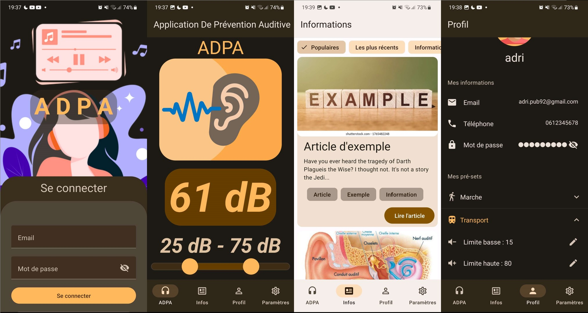
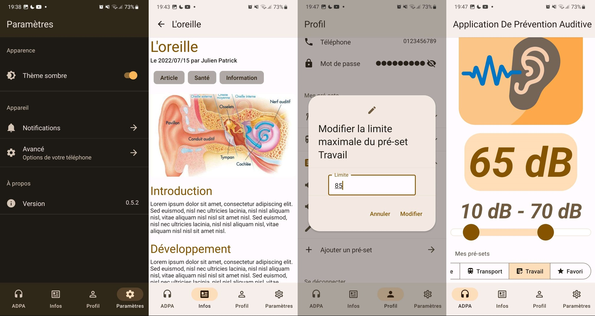

# PPE ADPA

## Introduction

Projet réalisé dans le cadre du Projet Pluridisciplinaire en Equipe (PPE) de l'année 2022-2023 à l'ECE Paris.

Application mobile en **React Native** permettant de contrôler le volume sonore sortant des périphériques audio connectés à un appareil mobile selon les décibels plutôt que le pourcentage.

### Descriptif du projet

#### Idée initiale

L'idée de base de ce projet est née du constat que les jeunes écoutent de la musique beaucoup trop fort. Dans le futur, cela conduira à une altération massive de la capacité auditive de la population française de demain, ce qui nous poussera à agir.
Dans un monde où ecouter sa musique trop fort avec des ecouteurs ou un casque est devenue banal, nous proposons une solution durable qui protège l'audition des utilisateurs, les sensibilise aux dangers, tout en ne modifiant pas leurs habitudes d'écoute.

#### Enjeux

- Un volume plus faible consomme moins de batterie, donc la durée de vie de la batterie est plus longue, donc conduit à une moindre consommation de ressources matérielles
- Protéger l'audition des utilisateurs

#### Raison d'être

Dans une société qui nous pousse à vivre dans des villes où la pollution sonore est omniprésente, trouver une solution durable qui réponde à la problématique de la santé de notre jeune génération devient pour nous une priorité.

### Solution proposée

Après avoir réalisé une étude de marché, nous avons pu décerner différents concurrents qui proposent une solution similaire mais différente puisqu'il s'agit de la réduction de bruit. Pour notre projet, nous proposons une solution totalement open-source ou les utilisateurs peuvent à la fois proposer de meilleures solutions à notre application sur certaines parties de la programmation. En ce qui concerne la partie utilisateur, il s'agirait de bien délimiter les niveaux d'audition en terme de décibel. L'objectif de notre solution déployée est de bien réaliser une prévention auditive.

## Conception

### Architecture

Le projet prend la forme d'une application mobile en **React Native** avec **Expo**. L'application est développée en **JavaScript**. L'interface graphique est réalisée avec **React Native Paper**. Les données sont stockées grâce à une API de stockage de données clé-valeur asynchrone nommée **Async Storage**. Cette API est asynchrone ce qui signifie que l'on peut stocker et récupérer nos données de cette manieres. Nous avons choisi d'utiliser cette solution en raison de la faible quantité de données nécessitant d'être stockée pour notre application.

L'interface graphique prend la forme d'une page d'accueil avec un menu de navigation en bas de l'écran. La page d'accueil affiche le volume sortant actuel ainsi que le slider permettant de le régler. La page de réglages permet de modifier les paramètres de l'application. La page de profil permet de modifier les informations de l'utilisateur, ainsi que ses pré-sets de volume. La page d'informations affiche des cartes présentant des articles sur la santé auditive. Chaque article est accessible en cliquant sur la carte. Chaque articles possèdes des tags permettant de les trier. La page de recherche permet de rechercher des articles par mots-clés. On pout ouvrir un article pour en lire le contenu complet.

Une page de connexion et d'inscription est disponible. L'inscription permet de créer un compte utilisateur. La connexion permet de se connecter à un compte utilisateur existant. Une fois connecté, l'utilisateur peut accéder à toutes les fonctionnalités de l'application. Une fois déconnecté, l'utilisateur est renvoyé sur la page de connexion.

### Fonctionnalités

- Affichage du volume sortant actuel
- Modification du volume sortant
- Modification des paramètres de l'application
- Modification des informations de l'utilisateur
- Modification des pré-sets de volume
- Affichage des articles sur la santé auditive
- Recherche d'articles par mots-clés
- Connexion et inscription
- Thème adaptatif (clair / sombre)

## Installation

### Prérequis

L'application ne dispose pour pas encore d'une version déployée. Pour l'utiliser, il faut donc la cloner depuis GitHub et l'installer sur un téléphone mobile ou un émulateur Android/iOS.

- Node.js
- Expo pour téléphone mobile (Android ou iOS) ou un émulateur Android/iOS

### Comment installer

- Cloner le dépôt GitHub

```bash
git clone https://github.com/Ahddry/PPE-ADPA
```

- Installer les dépendances

```bash
npm install
```

- Lancer l'application

```bash
npx expo start
```

- Ouvrir l'application sur un téléphone mobile ou un émulateur Android/iOS

Scanner le QR code avec l'application Expo sur un téléphone mobile ou lancer l'émulateur Android/iOS.

## Captures d'écran





## Contributeurs

- Adrien BLAIR [@Ahddry](https://github.com/Ahddry) (Développeur front-end)
- Maelys BOURGEAT [@Maelys92](https://github.com/Maelys92) (Responsable santé)
- Nicolas DREYFUS--LAQUIEZE [@Nicodl05](https://github.com/Nicodl05) (Développeur back-end)
- Lucie DUMONT [@luciedmt](https://github.com/luciedmt) (Recherche)
- Hugo HAIDAR [@Deemo1906](https://github.com/Deemo1906) (Partie hardware)
- Alix PARISOT [@alixprst](https://github.com/alixprst) (Cheffe de projet)
- Marie SIGVARDT [@MarieSigvardt](https://github.com/) (Recherche)
